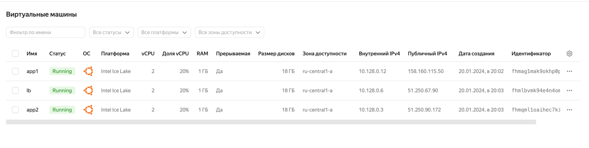
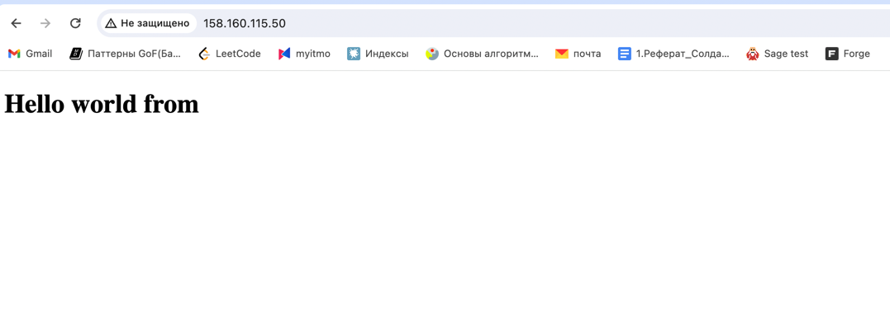
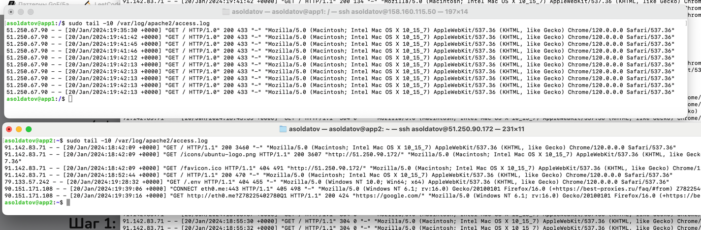

# Домашнее задание Ansible

## Описание виртуальных машин

- ВМ app1, app2 для установки на них web-приложения.
- ВМ lb для установки nginx

Очень сильно мучался с ВМ, поэтому сделал себе три ВМ в облаке Yandex Cloud. Ansible установил локально и дальше работал
так.

Я настроил им сеть и 80 порт открыл.

## Что нужно сделать

1. Выбрал http apache сервер, показывающий index.html.
2. [Создать плейбуки для развертывания необходимых пакетов для web-приложения.](appplaybook.yml). Для него завел роль
   application.
3. Обеспечить доступ к web-приложению и проверить его работу.
   Тут показываю, что приложение работает на app1.
4. [Создать плейбуки для установки nginx.](lbplaybook.yml)
   Аналогично создал роль nginx.
   
   Логи с обоих хостов приложения. Роунд робином ходит в оба.
5. С помощью ansible установить:
    - web-приложение на ВМ app1, app2
    - nginx на ВМ lb

```bash
ansible-playbook appplaybook.yml -kK
ansible-playbook lbplaybook.yml -kK
```